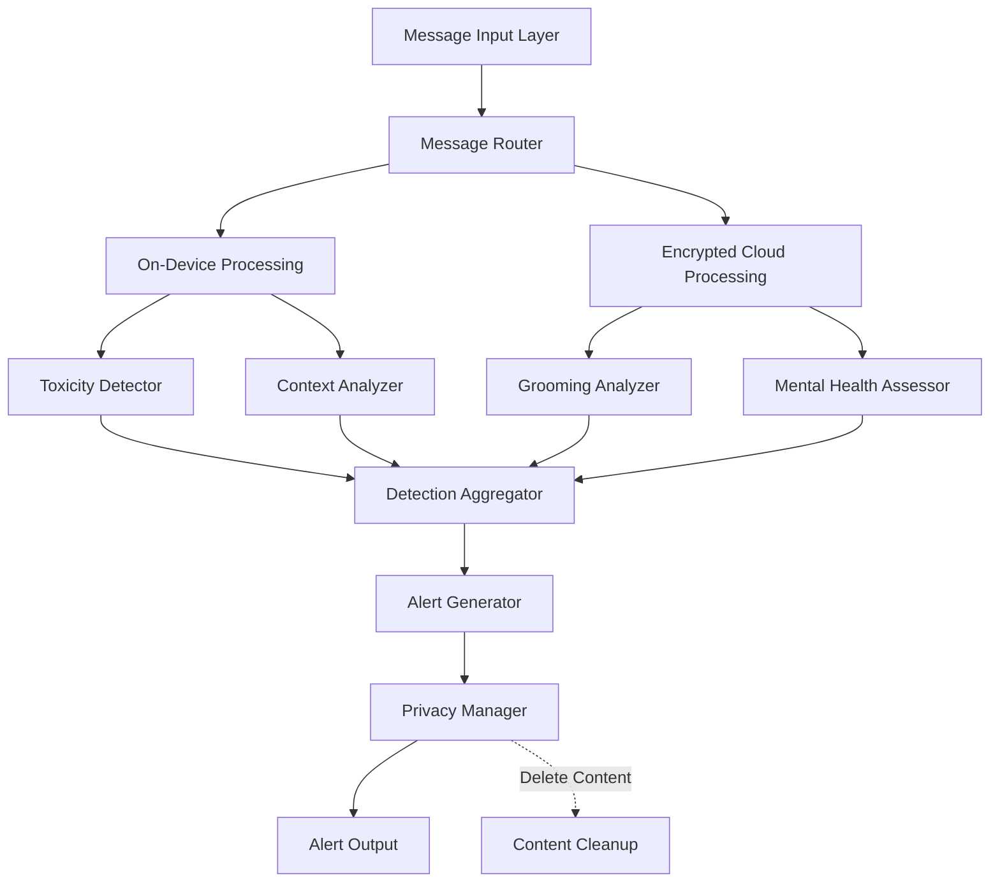

# Design Document: AI Content Moderation Engine

## Overview

The AI Content Moderation Engine is a multi-component system that analyzes children's digital communications in real-time to detect concerning content while maintaining strict privacy standards. The system employs multiple specialized AI models working in parallel: a BERT-based toxicity detector, a conversation pattern analyzer for grooming detection, and clinical NLP models for mental health risk assessment. All components feed into a unified alert generation system that provides explainable, severity-classified notifications to parents.

The architecture prioritizes privacy through on-device processing where possible, encrypted cloud processing for computationally intensive models, and immediate deletion of message content after analysis. The system is designed to achieve 89% accuracy while maintaining low false positive rates to prevent alert fatigue.

## Architecture

### High-Level Architecture



### Component Responsibilities

**Message Router**: Receives incoming messages from all platforms, normalizes format, and routes to appropriate processing pipeline (on-device vs. cloud) based on computational requirements.

**Toxicity Detector**: BERT-based model fine-tuned on teen communication patterns. Identifies toxic language, hate speech, threats, and harmful content. Runs on-device for low latency.

**Context Analyzer**: Evaluates age-appropriate context to distinguish teen slang from actual threats. Uses cultural and generational pattern databases. Runs on-device.

**Grooming Analyzer**: Analyzes multi-message conversation sequences to identify grooming behavior patterns. Requires conversation history context, runs in encrypted cloud environment.

**Mental Health Assessor**: Clinical NLP models validated by child psychologists. Identifies depression, self-harm, anxiety signals. Runs in encrypted cloud environment due to model complexity.

**Detection Aggregator**: Combines results from all detection components, resolves conflicts, and determines overall concern level.

**Alert Generator**: Creates explainable alerts with severity classification, relevant context excerpts, and parent-friendly explanations.

**Privacy Manager**: Enforces privacy policies, manages encryption, ensures content deletion, and controls what information is retained.

### Processing Pipelines

**Fast Path (On-Device)**:
1. Message received → Router
2. Toxicity detection (BERT inference ~100ms)
3. Context analysis (~50ms)
4. If concerning: Generate alert
5. Delete message content

**Deep Analysis Path (Cloud)**:
1. Message received → Router
2. Encrypt message content
3. Send to cloud for grooming/mental health analysis
4. Decrypt results
5. Combine with on-device results
6. Generate alert if needed
7. Delete all message content

## Components and Interfaces

### Message Router

```python
class MessageRouter:
    def route_message(message: CommunicationMessage) -> ProcessingPipeline:
        """
        Determines optimal processing pipeline for message.
        Returns ONDEVICE for simple toxicity checks, CLOUD for deep analysis.
        """
        
    def normalize_message(message: CommunicationMessage) -> NormalizedMessage:
        """
        Converts platform-specific message formats to unified internal format.
        Preserves metadata needed for context analysis.
        """
```

### Toxicity Detector

```python
class ToxicityDetector:
    def detect_toxicity(message: NormalizedMessage) -> ToxicityResult:
        """
        Analyzes message for toxic content using BERT model.
        Returns confidence score and text spans that triggered detection.
        """
        
    def get_toxic_spans(message: NormalizedMessage, result: ToxicityResult) -> List[TextSpan]:
        """
        Identifies specific text ranges that contain toxic content.
        """
        
    def supports_language(language_code: str) -> bool:
        """
        Checks if toxicity detection is available for given language.
        """
```

### Context Analyzer

```python
class ContextAnalyzer:
    def analyze_context(message: NormalizedMessage, toxicity_result: ToxicityResult) -> ContextResult:
        """
        Evaluates whether flagged content is age-appropriate slang or actual threat.
        Returns confidence score and context classification.
        """
        
    def is_teen_slang(text: str) -> bool:
        """
        Checks if text matches known teen slang patterns.
        """
        
    def get_confidence_score(message: NormalizedMessage) -> float:
        """
        Returns confidence level for context classification (0.0 to 1.0).
        """
```

### Grooming Analyzer

```python
class GroomingAnalyzer:
    def analyze_conversation(messages: List[NormalizedMessage]) -> GroomingResult:
        """
        Analyzes conversation sequence for grooming behavior patterns.
        Requires multiple messages for pattern detection.
        """
        
    def identify_pattern_progression(messages: List[NormalizedMessage]) -> List[GroomingStage]:
        """
        Identifies stages of grooming behavior in conversation history.
        """
        
    def get_conversation_context(messages: List[NormalizedMessage], result: GroomingResult) -> ConversationContext:
        """
        Extracts relevant conversation excerpts showing pattern progression.
        """
```

### Mental Health Assessor

```python
class MentalHealthAssessor:
    def assess_mental_health_risk(message: NormalizedMessage) -> MentalHealthResult:
        """
        Identifies mental health risk indicators using clinical NLP models.
        Returns risk type (depression, self-harm, anxiety) and confidence.
        """
        
    def classify_risk_type(message: NormalizedMessage) -> RiskType:
        """
        Determines specific type of mental health concern detected.
        """
        
    def distinguish_casual_from_distress(message: NormalizedMessage) -> bool:
        """
        Differentiates between casual expressions and genuine distress signals.
        """
```

### Detection Aggregator

```python
class DetectionAggregator:
    def aggregate_results(
        toxicity: Optional[ToxicityResult],
        context: Optional[ContextResult],
        grooming: Optional[GroomingResult],
        mental_health: Optional[MentalHealthResult]
    ) -> AggregatedResult:
        """
        Combines results from all detection components.
        Resolves conflicts and determines overall concern level.
        """
        
    def resolve_conflicts(results: List[DetectionResult]) -> DetectionResult:
        """
        Handles cases where different detectors provide conflicting assessments.
        """
        
    def calculate_overall_concern(results: AggregatedResult) -> ConcernLevel:
        """
        Determines overall concern level from aggregated detection results.
        """
```

### Alert Generator

```python
class AlertGenerator:
    def generate_alert(aggregated: AggregatedResult, message: NormalizedMessage) -> Alert:
        """
        Creates explainable alert with severity classification and context.
        """
        
    def classify_severity(aggregated: AggregatedResult) -> SeverityLevel:
        """
        Assigns severity level (Critical, High, Medium, Low) based on detection results.
        """
        
    def create_explanation(aggregated: AggregatedResult) -> str:
        """
        Generates parent-friendly explanation of why alert was triggered.
        """
        
    def extract_context_excerpts(message: NormalizedMessage, aggregated: AggregatedResult) -> List[str]:
        """
        Extracts minimal necessary context for alert without including full message.
        """
```

### Privacy Manager

```python
class PrivacyManager:
    def encrypt_for_cloud(message: NormalizedMessage) -> EncryptedMessage:
        """
        Encrypts message content for cloud processing.
        """
        
    def decrypt_results(encrypted_results: EncryptedResults) -> DetectionResults:
        """
        Decrypts results from cloud processing.
        """
        
    def delete_message_content(message: NormalizedMessage) -> None:
        """
        Permanently deletes message content after analysis.
        """
        
    def sanitize_alert(alert: Alert) -> Alert:
        """
        Ensures alert contains only necessary context, not full message content.
        """
```

## Data Models

### CommunicationMessage

```python
@dataclass
class CommunicationMessage:
    message_id: str
    platform: Platform  # SMS, SOCIAL_MEDIA, GAME_CHAT
    sender_id: str
    recipient_id: str
    content: str
    timestamp: datetime
    language: str
    metadata: Dict[str, Any]
```

### NormalizedMessage

```python
@dataclass
class NormalizedMessage:
    message_id: str
    platform: Platform
    content: str
    timestamp: datetime
    language: str
    conversation_id: Optional[str]
    normalized_content: str  # Cleaned, standardized text
```

### ToxicityResult

```python
@dataclass
class ToxicityResult:
    is_toxic: bool
    confidence: float  # 0.0 to 1.0
    toxic_spans: List[TextSpan]
    toxicity_types: List[ToxicityType]  # HATE_SPEECH, THREAT, HARASSMENT, etc.
```

### ContextResult

```python
@dataclass
class ContextResult:
    is_actual_threat: bool
    is_teen_slang: bool
    confidence: float
    context_classification: ContextClassification
    explanation: str
```

### GroomingResult

```python
@dataclass
class GroomingResult:
    grooming_detected: bool
    confidence: float
    pattern_stages: List[GroomingStage]
    conversation_context: ConversationContext
```

### MentalHealthResult

```python
@dataclass
class MentalHealthResult:
    risk_detected: bool
    risk_type: RiskType  # DEPRESSION, SELF_HARM, ANXIETY
    confidence: float
    is_genuine_distress: bool
    indicators: List[str]
```

### AggregatedResult

```python
@dataclass
class AggregatedResult:
    concern_detected: bool
    concern_level: ConcernLevel
    toxicity: Optional[ToxicityResult]
    context: Optional[ContextResult]
    grooming: Optional[GroomingResult]
    mental_health: Optional[MentalHealthResult]
    primary_concern: ConcernType
```

### Alert

```python
@dataclass
class Alert:
    alert_id: str
    severity: SeverityLevel  # CRITICAL, HIGH, MEDIUM, LOW
    timestamp: datetime
    concern_type: ConcernType
    explanation: str
    context_excerpts: List[str]
    detection_details: Dict[str, Any]
    recommended_action: str
```

### Enumerations

```python
class Platform(Enum):
    SMS = "sms"
    SOCIAL_MEDIA = "social_media"
    GAME_CHAT = "game_chat"

class SeverityLevel(Enum):
    CRITICAL = "critical"
    HIGH = "high"
    MEDIUM = "medium"
    LOW = "low"

class ConcernType(Enum):
    TOXICITY = "toxicity"
    GROOMING = "grooming"
    MENTAL_HEALTH = "mental_health"
    MULTIPLE = "multiple"

class RiskType(Enum):
    DEPRESSION = "depression"
    SELF_HARM = "self_harm"
    ANXIETY = "anxiety"
```


## Correctness Properties

A property is a characteristic or behavior that should hold true across all valid executions of a system—essentially, a formal statement about what the system should do. Properties serve as the bridge between human-readable specifications and machine-verifiable correctness guarantees.

### Property 1: Toxicity Detection Completeness

*For any* Communication_Message containing toxic language, the Toxicity_Detector should identify it and return a ToxicityResult with a confidence score between 0.0 and 1.0, and non-empty toxic_spans when is_toxic is True.

**Validates: Requirements 1.1, 1.4**

### Property 2: Multi-lingual Toxicity Support

*For any* supported language code and toxic message in that language, the Toxicity_Detector should successfully detect toxicity with confidence above a minimum threshold.

**Validates: Requirements 1.2**

### Property 3: Processing Latency Bounds

*For any* Communication_Message, the Moderation_Engine should complete full analysis (all detection components) within 2 seconds.

**Validates: Requirements 1.3, 8.2**

### Property 4: Context-Aware Slang Handling

*For any* message containing known teen slang without actual threats, the Context_Analyzer should classify it as is_teen_slang=True and is_actual_threat=False, preventing false toxicity alerts.

**Validates: Requirements 1.5, 4.1**

### Property 5: Grooming Pattern Detection in Sequences

*For any* conversation sequence containing grooming behavior patterns, the Grooming_Analyzer should detect it and provide non-empty conversation_context showing pattern progression across multiple messages.

**Validates: Requirements 2.1, 2.2, 2.3**

### Property 6: Mental Health Risk Classification

*For any* message containing mental health risk indicators, the Mental_Health_Assessor should identify the specific risk_type (DEPRESSION, SELF_HARM, or ANXIETY) and distinguish genuine distress (is_genuine_distress=True) from casual expressions.

**Validates: Requirements 3.1, 3.3**

### Property 7: Confidence Score Validity

*For any* analysis result from Context_Analyzer, Toxicity_Detector, Grooming_Analyzer, or Mental_Health_Assessor, the confidence score should be a valid float between 0.0 and 1.0 inclusive.

**Validates: Requirements 4.3**

### Property 8: False Positive Rate Constraint

*For any* validated test dataset of non-concerning messages, the Moderation_Engine should maintain a false positive rate (incorrectly flagged messages / total messages) below 0.15 (15%).

**Validates: Requirements 4.4**

### Property 9: Cloud Data Encryption

*For any* message routed to cloud processing, the Privacy_Manager should encrypt it before transmission, and the encrypted result should not contain plaintext message content.

**Validates: Requirements 5.2**

### Property 10: Content Deletion After Processing

*For any* Communication_Message processed by the Moderation_Engine, the message content should be deleted immediately after analysis completes, with no full content retained in storage.

**Validates: Requirements 5.3, 5.4**

### Property 11: Alert Context Minimization

*For any* generated Alert, the context_excerpts should contain only necessary snippets (not full message content), and the total length of excerpts should be less than the original message length.

**Validates: Requirements 5.5**

### Property 12: Alert Explanation Completeness

*For any* generated Alert, the explanation field should be non-empty, and when multiple detection systems trigger (aggregated result has multiple non-None components), the explanation should reference all triggered systems.

**Validates: Requirements 6.1, 6.2**

### Property 13: Alert Span Highlighting

*For any* Alert with detection_details containing text spans, those spans should be present in the context_excerpts and properly bounded within the excerpt text.

**Validates: Requirements 6.3**

### Property 14: Severity Level Validity

*For any* generated Alert, the severity field should be one of the four valid SeverityLevel enum values (CRITICAL, HIGH, MEDIUM, LOW).

**Validates: Requirements 6.4**

### Property 15: Platform Message Normalization

*For any* Communication_Message from any supported platform (SMS, SOCIAL_MEDIA, GAME_CHAT), the Message_Router should produce a NormalizedMessage with consistent structure (non-empty normalized_content, valid timestamp, language code).

**Validates: Requirements 7.4**

### Property 16: Severity Classification Correctness

*For any* AggregatedResult, the Alert_Generator should assign severity according to these rules:
- If mental_health.risk_type == SELF_HARM or immediate danger detected → CRITICAL
- If grooming_detected == True → HIGH or CRITICAL
- If only toxicity detected without other factors → MEDIUM
- If low-confidence or minor concerns → LOW

**Validates: Requirements 2.4, 3.4, 9.1, 9.2, 9.3, 9.4**

### Property 17: Severity Explanation Presence

*For any* Alert, the explanation should contain information about why the specific severity level was assigned (mention of severity criteria).

**Validates: Requirements 9.5**

### Property 18: Performance Warning Logging

*For any* message where processing latency exceeds 2 seconds, the Moderation_Engine should log a performance warning with message_id and actual latency.

**Validates: Requirements 10.3**

### Property 19: Accuracy Standard Compliance

*For any* validated test dataset reviewed by child psychology experts, the Moderation_Engine should achieve at least 89% accuracy in correctly identifying concerning vs. non-concerning content.

**Validates: Requirements 8.1**

### Property 20: Cross-Language-Platform Performance Consistency

*For any* combination of supported language and platform, the Moderation_Engine should maintain processing latency under 2 seconds and accuracy above 89%.

**Validates: Requirements 8.5**

## Error Handling

### Detection Errors

**Model Inference Failures**: If any AI model (BERT, grooming analyzer, mental health assessor) fails during inference, the system should:
- Log the error with model name, message_id, and error details
- Continue processing with remaining detection components
- Mark the failed component as unavailable in AggregatedResult
- Generate alert if other components detected concerns
- Never crash or block message processing

**Language Not Supported**: If a message language is not supported by toxicity detection:
- Log warning with language code and message_id
- Attempt processing with English model as fallback
- Mark result with low confidence
- Include language limitation in alert explanation if generated

### Privacy Errors

**Encryption Failures**: If message encryption fails before cloud processing:
- Log critical error with message_id
- Abort cloud processing for that message
- Continue with on-device processing only
- Alert system administrators of encryption failure

**Deletion Failures**: If message content deletion fails:
- Log critical error with message_id
- Retry deletion up to 3 times
- Escalate to system administrators if retries fail
- Never proceed with storing undeleted content

### Performance Errors

**Latency Threshold Exceeded**: If processing exceeds 2 seconds:
- Log performance warning with message_id and actual latency
- Complete processing (don't abort)
- Track latency metrics for system monitoring
- Alert if sustained latency issues detected

**High Load Conditions**: If message queue exceeds capacity:
- Prioritize messages with preliminary high-severity indicators
- Log load warning with queue depth
- Apply backpressure to message sources if possible
- Never drop messages without logging

### Data Validation Errors

**Invalid Message Format**: If incoming message fails validation:
- Log error with message_id and validation failure reason
- Attempt to extract and normalize whatever content is available
- If normalization impossible, skip processing and log
- Return error status to message source

**Missing Required Fields**: If message lacks required fields (content, timestamp, platform):
- Log error with message_id and missing fields
- Use sensible defaults where possible (current time for timestamp)
- If content is missing, cannot process - log and skip

## Testing Strategy

### Dual Testing Approach

The AI Content Moderation Engine requires both unit testing and property-based testing for comprehensive validation:

**Unit Tests** focus on:
- Specific examples of toxic, grooming, and mental health content
- Edge cases (empty messages, very long messages, special characters)
- Error conditions (model failures, encryption errors, invalid inputs)
- Integration points between components
- Platform-specific message handling examples

**Property-Based Tests** focus on:
- Universal properties that hold across all inputs
- Comprehensive input coverage through randomization
- Validation of correctness properties defined in this document
- Statistical properties (accuracy rates, false positive rates)
- Performance properties (latency bounds)

Both testing approaches are complementary and necessary. Unit tests catch concrete bugs and validate specific scenarios, while property tests verify general correctness across the input space.

### Property-Based Testing Configuration

**Framework Selection**: Use Hypothesis (Python) for property-based testing, as it provides:
- Sophisticated input generation strategies
- Automatic shrinking of failing examples
- Stateful testing for conversation sequences
- Integration with pytest

**Test Configuration**:
- Minimum 100 iterations per property test (due to randomization and ML model variability)
- Each property test must reference its design document property
- Tag format: `# Feature: ai-content-moderation-engine, Property {number}: {property_text}`

**Example Property Test Structure**:

```python
from hypothesis import given, strategies as st
import pytest

# Feature: ai-content-moderation-engine, Property 1: Toxicity Detection Completeness
@given(st.text(min_size=1).filter(lambda t: contains_toxic_content(t)))
def test_toxicity_detection_completeness(toxic_message):
    """For any message containing toxic language, detector should identify it."""
    message = create_communication_message(content=toxic_message)
    normalized = router.normalize_message(message)
    result = toxicity_detector.detect_toxicity(normalized)
    
    assert result.is_toxic, "Toxic content should be detected"
    assert 0.0 <= result.confidence <= 1.0, "Confidence should be valid"
    if result.is_toxic:
        assert len(result.toxic_spans) > 0, "Should provide toxic spans"
```

### Test Data Requirements

**Validated Test Datasets**:
- Curated dataset of 10,000+ messages reviewed by child psychologists
- Balanced representation of concerning vs. non-concerning content
- Multi-lingual examples covering all supported languages
- Platform-specific examples (SMS, social media, game chat)
- Labeled with ground truth for accuracy validation

**Synthetic Test Data**:
- Generated messages with known toxic patterns
- Conversation sequences with grooming behavior patterns
- Mental health risk indicator examples
- Teen slang database for context testing
- Edge cases (empty, very long, special characters, emojis)

### Integration Testing

**End-to-End Flows**:
- Message ingestion → routing → detection → alert generation → privacy cleanup
- Multi-component detection scenarios (toxicity + mental health)
- Cloud processing path with encryption/decryption
- Error recovery scenarios (model failures, encryption errors)

**Performance Testing**:
- Latency validation under normal load
- Sustained throughput testing (1000 messages/minute)
- Memory usage monitoring (ensure no content leaks)
- Model inference time profiling

### Accuracy Validation

**Validation Process**:
1. Run Moderation_Engine on validated test dataset
2. Compare predictions to ground truth labels
3. Calculate accuracy: (correct predictions / total messages)
4. Calculate false positive rate: (false alarms / non-concerning messages)
5. Verify accuracy ≥ 89% and false positive rate < 15%
6. Break down accuracy by concern type, language, and platform
7. Review failures with child psychology experts

**Continuous Validation**:
- Re-validate accuracy after any model updates
- Monitor production accuracy metrics
- Collect edge cases for test dataset expansion
- Regular review with child psychology experts
